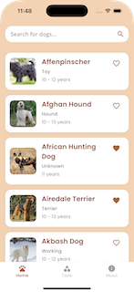
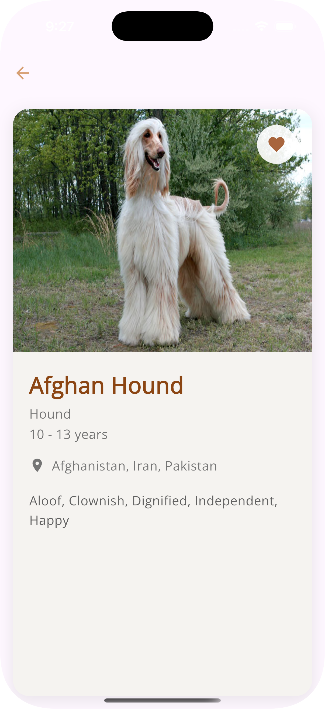
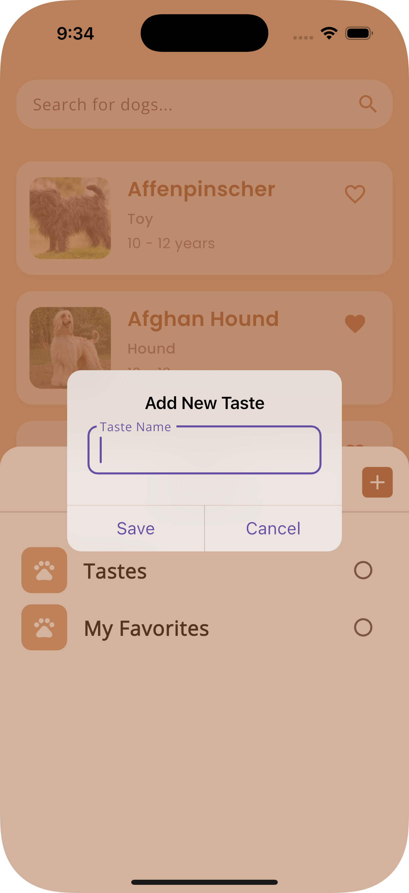
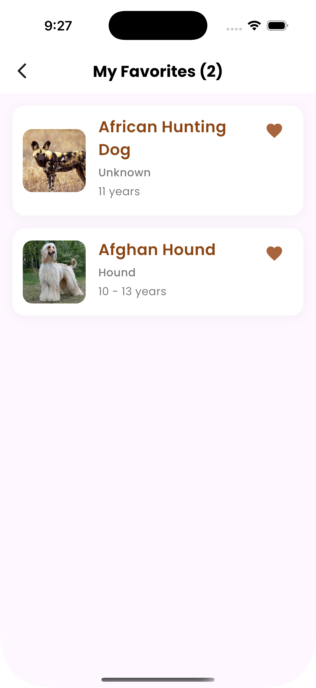

# 🐶 TasteMaster - Flutter App

**TasteMaster** is a mobile application developed with Flutter that allows users to explore dog breeds from a public API and save their favorites as personalized "tastes." Each taste can be given a user-defined name and is stored locally on the device.

## 📱 Features

- 🔍 **Explore dog breeds** from [The Dog API](https://thedogapi.com/).
- 🐾 **Create personalized tastes** by assigning them a name.
- 📂 **Save tastes locally** using Hive.
- 📋 **List saved tastes** with images and names.
- 🗑️ **Delete individual tastes** easily.
- 🧾 **View taste details**, including API data and image.
- 💡 Responsive UI adapted for different screen sizes.

## 🧱 Project Architecture

Follows a modular and scalable structure based on Clean Architecture principles:

```
lib/src
├── core/ # Themes, styles, helpers
├── data/ # Models, repositories
├── logic/ # Cubits for state (API, tastes)
├── presentation/ # Screens and widgets
└── main.dart # Main entry point
```

## 🚀 Installation & Setup

1. **Clone the repository**
```bash
git clone https://github.com/WGPQ/taste-master.git
cd taste-master
```

2. **Install dependencies**
```bash
flutter pub get
```

3. **Run the app**
```bash
flutter run
```

## 🧪 Testing

Includes unit and widget tests:

- ✅ **Cubit Tests**: for `ApiCubit` and `PreferenceCubit`.
- ✅ **Widget Tests**: taste widget add form taste, bottom navigation bar .

To run tests:

```bash
flutter test
```

## 🔀 Navigation

Named routes are used for easy navigation:

| Route             | Description                                    |
|------------------|------------------------------------------------|
| `/home`          | List of dog breeds from API                    |
| `/dogDetails`    | View dog details                               |
| `/taste`         | View list of saved tastes                      |
| `/tasteDetails`  | View details and list of dogs in a taste       |
| `/about`         | View app details                               |

## 💡 Key Technical Decisions

- **State management** using `flutter_bloc` and `Cubit` to separate logic from UI.
- **Local persistence** with Hive for easy setup and performance.
- **Robust API consumption** with state handling (`loading`, `success`, `error`).
- **Clean architecture** following SOLID principles.

## 📸 Screenshots








## 🧑‍💻 Author

Developed by William Puma